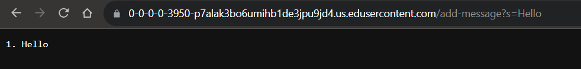
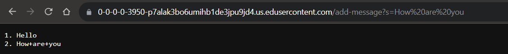
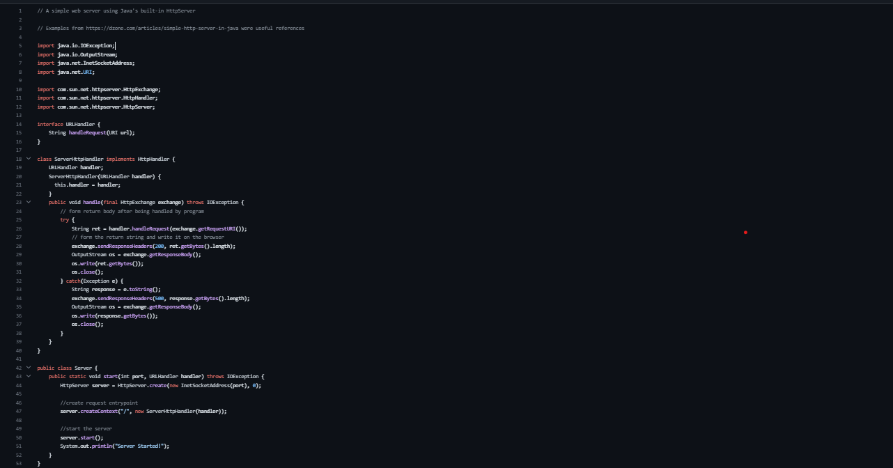
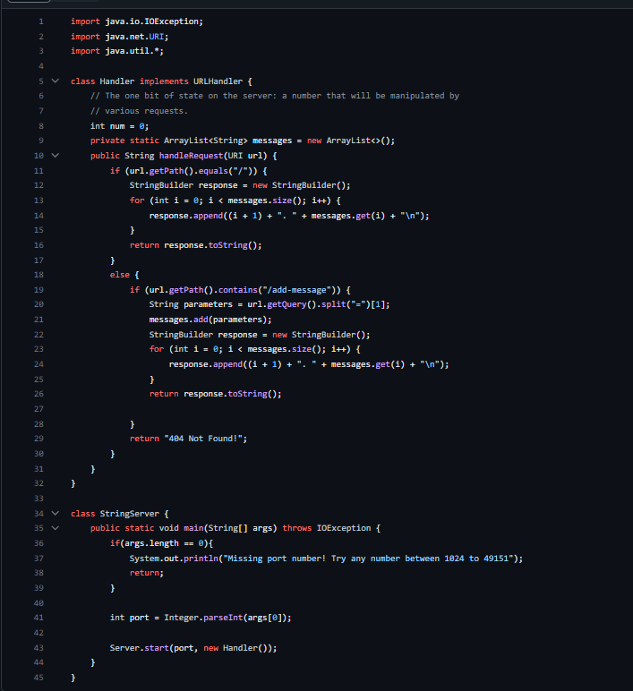

  
1. The method in my code that handles the request is `handleRequest(URI url)`, which takes the url path of the webserver and sees what the user is asking.  
2. The relevant argument of the method  `handleRequest` is `URI URL`, which is basically the path of the webserver. It allows us to see whether the user is asking to add a new string to the server.  
3. No values got changed in this request, as "Hello remains the same.  

  
1. The method in my code that handles the request is `handleRequest(URI url)`, which takes the url path of the webserver and sees what the user is asking.  
2. The relevant argument of the method  `handleRequest` is `URI URL`, which is basically the path of the webserver. It allows us to see whether the user is asking to add a new string to the server.  
3. The values got changed in this request are the spaces(" ") as they became "+" signs for some reason.  

Code:  
`Server.java`    
     
`StringServer.java`  

     

