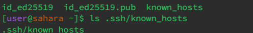
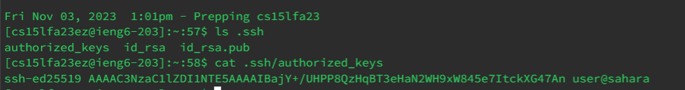

PART 1     

  
1. The method in my code that handles the request is `handleRequest(URI url)`, which takes the url path of the webserver and sees what the user is asking.  
2. The relevant argument of the method  `handleRequest` is `URI URL`, which is basically the path of the webserver. It allows us to see whether the user is asking to add a new string to the server.  
3. The values that would be after `/add-message?s=`. An input that is valid after the `=` will be added to the list and shown on the webpage. In this case, it was the string "Hello". If an invalid input was typed, it would return  `404 not found message`.      

  

  
1. The method in my code that handles the request is `handleRequest(URI url)`, which takes the url path of the webserver and sees what the user is asking.  
2. The relevant argument of the method  `handleRequest` is `URI URL`, which is basically the path of the webserver. It allows us to see whether the user is asking to add a new string to the server.  
3. The values that would be after `/add-message?s=`. An input that is valid after the `=` will be added to the list and shown on the webpage. In this case, it was the string "How are you". If an invalid input was typed, it would return  `404 not found message`. The other values that got changed in this request are the spaces(" ") as they became "+" signs for some reason.  

Code:  
`Server.java`    
     
`StringServer.java`  

     

PART 2    

Private Key   
   

Public Key    
  

No Password Login   
    

Part 3  

In week 3, I learned about the ssh commands, how to start and work with a server, and creat public and private keys. Through servers, I learned how to change paths on a webpage to reflect certain changes. I learned different ways to manipulate a remote computer to login.

